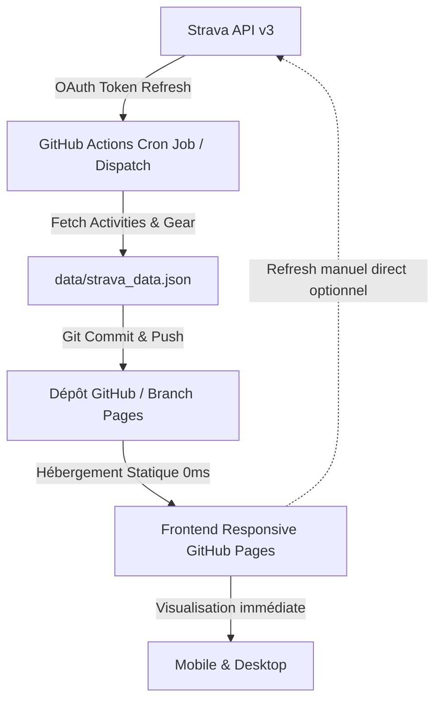

# Spécification Technique & Design : Strava Runner Dashboard ("Editorial Paper")

**Date** : 2026-08-28  
**Auteur** : Antigravity  
**Statut** : Validé pour implémentation  

---

## 1. Vision du Produit & Direction Artistique

### 1.1 Objectif
Créer un tableau de bord personnel de course à pied connecté à l'API Strava, déployable directement sur **GitHub Pages**, utilisable de manière réactive sur **Mobile (iOS/Android)** et **Desktop (PC/Mac)**, sans nécessiter de serveur payant ou de maintenance manuelle au quotidien.

### 1.2 Direction Artistique : *Editorial / Runner Paper*
L'interface s'inspire des publications athlétiques haut de gamme (*Tracksmith*, *METER Magazine*, *Strava Year in Sport*) :
- **Atmosphère** : Fond clair papier texturé et chaud (`#FBF9F5` / `#F5F1EA`), bordures douces et cartes chaleureuses (`#FFFFFF` avec contours fins `#EAE5DB`).
- **Accents de couleur** :
  - *Terracotta / Ambre Signature* : `#E05A36` (accent principal d'énergie et de distance)
  - *Sauge / Vert Forêt* : `#3A6B56` (pour les streaks, régularité et dénivelé)
  - *Bleu Cobalt Doux* : `#2D5B88` (pour les records, allures et temps)
  - *Ardoise / Carbone* : `#232526` (typographie principale à fort contraste et lisibilité parfaite)
- **Typographie** :
  - Titres & Chiffres Clés : **Outfit** ou **Plus Jakarta Sans** (chiffres tabulaires nets, lisibles en un coup d'œil)
  - Corps de texte & Métriques secondaires : **Instrument Sans** / **Inter**
  - Chiffres de chronométrie & allures : Monospace élégant / Chiffres tabulaires (`font-variant-numeric: tabular-nums`)
- **Micro-interactions** :
  - Survol doux sur les cartes avec légère élévation (`box-shadow: 0 4px 16px rgba(0,0,0,0.04)`)
  - Tooltips contextuels sur les graphiques
  - Filtres instantanés par période (Tout, Année en cours, 30 derniers jours)

---

## 2. Architecture Technique & Déploiement



### 2.1 Composants Techniques
1. **Frontend App (TypeScript + Vite)** :
   - Structure : HTML5 sémantique, architecture modulaire en **TypeScript strict** avec **Vite** comme bundler ultra-rapide optimisé pour GitHub Pages.
   - Types stricts : Interfaces complètes pour les activités Strava, l'athlète, les statistiques cumulées, les segments et l'équipement.
   - Styles : CSS natif structuré avec variables CSS (Design System Tokens "Runner Paper"), responsive mobile-first avec conteneurs adaptatifs (`clamp()`, `minmax()`, flexbox & CSS grid).
   - Librairies embarquées typées :
     - *Chart.js* (graphiques interactifs YTD et distributions mensuelles)
     - *Leaflet* + *@types/leaflet* (rendu cartographique des traces GPS et de la Heatmap)
     - *Lucide* (icônes SVG nettes et légères)
2. **Synchronisation Automatique (GitHub Actions)** :
   - Workflow `.github/workflows/strava-sync.yml` s'exécutant automatiquement (ex. toutes les 6h ou déclenché manuellement via bouton "Run workflow" ou webhook).
   - Script Python ou Node.js `scripts/sync_strava.py` qui :
     - Échange le `REFRESH_TOKEN` contre un `ACCESS_TOKEN` valide.
     - Récupère toutes les activités de course à pied (`type: Run`), les statistiques d'athlète et le matériel (`gear`).
     - Calcule les métriques dérivées (Top 3 5k, 10k, semi, allures, clusters mensuels, records, usure des chaussures).
     - Écrit le résultat consolidé dans `data/strava_data.json`.
3. **Sécurité & Code d'accès** :
   - Secrets Strava stockés dans les GitHub Actions Secrets (jamais exposés dans le code source).
   - Accès public direct aux données de lecture ou déverrouillage via code PIN local stocké dans la session si l'utilisateur souhaite restreindre la vue des cartes privées.

---

## 3. Modules Fonctionnels du Dashboard

### 3.1 En-tête & Athlète Hub
- Nom & Photo de profil, badge athlète.
- Horodatage de la dernière synchronisation + bouton de rafraîchissement rapide.
- Sélecteur de période dynamique : **Global (All-Time)** | **Année en cours (YTD)** | **Mois en cours** | **30 Derniers Jours**.

### 3.2 Bandeau Hero (Métriques All-Time / Période)
- **Activités** : Nombre total de sorties (ex: `280`).
- **Distance Cumulée** : Kilomètres totaux (ex: `2 261 km`).
- **Calories Estimées** : Énergie dépensée (ex: `163 957 kcal`).
- **Streak Actuel & Hebdo** : Nombre de semaines consécutives actives (ex: `51 sem.`) avec pastilles des jours courus (L M M J V S D).

### 3.3 Moyennes & Régularité (Historique)
- Sorties par semaine (ex: `2.3`).
- Temps passé par semaine (ex: `1h 43m`).
- Distance par semaine (ex: `18.3 km`).
- Calories par semaine (ex: `1 326 kcal`).

### 3.4 Graphiques d'Évolution & Distribution
- **Courbe YTD Cumulée** : Progression mensuelle de la distance parcourue dans l'année avec métriques YTD (Sorties YTD, Temps YTD, Distance YTD, D+ YTD).
- **Distribution Mensuelle** : Histogramme à barres montrant la distance (km) et les calories mois par mois.

### 3.5 Matrice de Constance (Run Contribution Heatmap)
- Grille façon GitHub de 52 semaines illustrant la régularité sur l'année avec intensité de couleur selon le kilométrage journalier.

### 3.6 Records Personnels & Best Efforts (Hall of Fame)
- **Top 3 - 5 km** : Meilleurs temps réalisés avec date et nom de la séance.
- **Top 3 - 10 km** : Meilleurs temps 10 km.
- **Top 3 - Sorties Longues (15k+)** : Sorties les plus longues en endurance.
- **Records de Vitesse & Dénivelé** : Allure la plus rapide et sortie la plus montagneuse.

### 3.7 Gestionnaire du Parc de Chaussures (Gear Locker)
- Liste des paires enregistrées (*Adidas Adizero EVO SL*, *Adidas Ultraboost 21 GTX*, *Nike Pegasus 41 Blueprint*, etc.).
- Jauge d'usure kilométrique visuelle avec palier de fin de vie conseillé (ex: 800 km).
- Temps cumulé d'utilisation et allure moyenne par paire.

### 3.8 Carte Interactive des Tracés GPS & Heatmap
- Carte interactive embarquée affichant :
  - Le tracé GPS détaillé de la dernière sortie (avec profil d'élévation).
  - La superposition de tous les tracés GPS enregistrés (Heatmap personnelle).

### 3.9 Flux Détaillé des Dernières Activités
- Liste des 10+ dernières activités avec :
  - Titre, date, heure de départ.
  - Métriques clés : Distance (km), Durée, Allure moyenne (min/km), Dénivelé (m), Calories (kcal).
  - Paire de chaussures utilisée.
  - Visualisation du mini-tracé et modal de détail au clic.

---

## 4. Structure des Fichiers du Projet

```text
strava_dashboard/
├── index.html                   # Point d'entrée HTML
├── package.json                 # Dépendances Vite, TypeScript, Chart.js, Leaflet, Lucide
├── tsconfig.json                # Configuration TypeScript
├── vite.config.ts               # Configuration Vite (base path pour GitHub Pages)
├── src/
│   ├── types/
│   │   └── strava.ts            # Interfaces TypeScript (Athlete, Activity, Gear, Metrics, BestEfforts)
│   ├── css/
│   │   ├── design-system.css    # Variables CSS, typographies, tokens de couleur "Runner Paper"
│   │   ├── layout.css           # Grille responsive, navbar, conteneurs
│   │   └── components.css       # Cartes, jauges, badges, graphiques, tables, map
│   ├── services/
│   │   └── data-service.ts      # Chargement du JSON, typage strict, cache et fallback démo
│   ├── utils/
│   │   ├── metrics.ts           # Moteur de calcul typé des records, streaks et moyennes
│   │   └── polyline.ts          # Décodeur de polyline GPS pour la carte
│   ├── components/
│   │   ├── charts.ts            # Rendu et typage des graphiques Chart.js
│   │   ├── map.ts               # Moteur cartographique Leaflet (GPS & Heatmap)
│   │   └── ui-renderer.ts       # Rendu dynamique du DOM (Hero, Gear Locker, Activities, Modals)
│   └── main.ts                  # Point d'entrée de l'application TypeScript
├── data/
│   └── strava_data.json         # Données d'activités synchronisées
├── scripts/
│   └── sync_strava.py           # Script d'ingestion et d'extraction Strava API
├── .github/
│   └── workflows/
│       ├── strava-sync.yml      # Synchronisation automatique des données Strava
│       └── deploy.yml           # Déploiement automatique Vite -> GitHub Pages
└── README.md                    # Documentation de configuration et tokens Strava
```

---

## 5. Plan de Vérification & Tests

1. **Vérification Visuelle & Ergonomie** :
   - Test d'affichage responsive sur mobile (viewport 375px et 414px) et écran large (1440px+).
   - Validation du contraste des couleurs (norme WCAG AAA pour le texte et les jauges).
2. **Vérification Fonctionnelle des Données** :
   - Contrôle de la correspondance exacte avec les données fournies dans l'ébauche (280 sorties, 2261 km, 163957 kcal, 51 sem de streak, Top 5k/10k/15k, Gear).
   - Test des filtres temporels (Global vs YTD vs 30j).
3. **Vérification Cartographique** :
   - Test du décodage de polyligne et rendu des traces sur Leaflet.
4. **Vérification de la Synchro GitHub Actions** :
   - Test d'exécution du script `sync_strava.py` en environnement local et simulation CI/CD.
